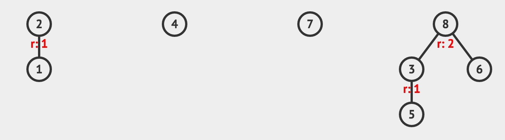

Union-Find Disjoint Set
=======================

.. note::

    Tested on: UVA599, UVA10583, UVA11503

.. code-block:: cpp

    #include <iostream> // cout, endl
    #include <cstring>  // memset

    using namespace std;

    class UFDS{
    public:
        int size;
        int * parents;
        int * heights;

        UFDS(int s)
        {
            // Using 0 as sentinel
            size = s + 1;

            parents = new int[size];
            memset(parents, 0, size*sizeof(int));

            heights = new int[size];
            memset(heights, 0, size*sizeof(int));
        }

        int find_set(int x)
        {
            /*
                find_set: returns the root of the set that x belongs

                Complexity: worst case O(N), but it is amortized with the usage
            */

            int root = parents[x];

            // If it found a root, return it
            if(x == root) return x;

            // If the value of parents[x] is not setted yet, which means that it
            // has the default value 0
            if(root == 0){
                parents[x] = x;
                return x;
            }

            // x is not the root of the set, look to its father root and update the
            // x root to be the set root
            parents[x] = find_set(root);

            // return x updated root
            return parents[x];
        }

        inline bool same_set(int x, int y)
        {
            /*
                same_set: checks if x and y belong to the same set

                Complexity: O(N) because if find_set (time amortization)
            */

            return find_set(x) == find_set(y);
        }

        void union_set(int x, int y)
        {
            /*
                union_set: joins two sets if they are not from the same set
                           The rule for join is to join the smaller set into the
                           larger.

                Complexity: O(N) because if find_set (time amortization)
            */

            int root1 = find_set(x);
            int root2 = find_set(y);

            // If is not from the same set
            if(root1 != root2)
            {
                if(heights[root1] >= heights[root2])
                {
                    parents[root2] = root1;
                    heights[root1] += heights[root2];
                }
                else
                {
                    parents[root1] = root2;
                    heights[root2] += heights[root1];
                }
            }
        }
    };

Usage:

.. code-block:: cpp

    int main()
    {
        UFDS ufds(8);

        ufds.union_set(1, 2);
        ufds.union_set(5, 3);
        ufds.union_set(6, 8);
        ufds.union_set(5, 8);

        return 0;
    }

Usage graphical representation:

After class instantiation:

After unions:

.. toctree::
   :maxdepth: 2
